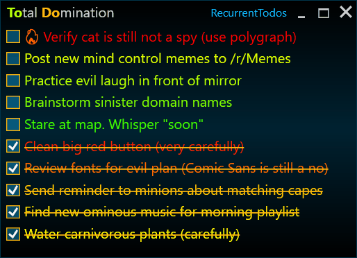

# TOtal DOmination


This is a tiny to-do list app for recurring tasks that I built for myself.

To-do items are sorted and color-coded depending on how long ago they were last done. A tooltip shows detailed statistics.

## Motivation
I needed a to-do list app for tasks that recur regularly, but not every day. I'm happy with my current systems for daily tasks, one-off tasks, and projects. However, for recurring tasks that don't need to be done daily, I didn't have a good system. I didn't like adding them to the daily list because I hated leaving them undone at the end of the day. Adding them to traditional to-do lists with workarounds to account for their recurring nature didn't work either.

That's why I made an app specifically for recurring tasks, tailored to my own needs. For example, I don't need to add or edit tasks (my list changes very rarely, and it's convenient to store and edit it in a text file), but I do need detailed statistics for each task, including the average time between completions and a full history.

## Description
To-do items are added from a pipe-delimited text file ([see example here](RecurrentTodos.txt)). Each task has a "frequency" assigned to it. This is a value that specifies how often I plan to do that task relative to others. For example, I plan to do a task with a frequency of 3 three times more often than a task with a frequency of 1.

The tasks in the list are sorted in descending order by their "urgency" (which is defined as the number of days since they were last done, multiplied by their frequency and the target productivity in tasks per day). This means that tasks with a higher frequency rise to the top faster. If all tasks had the same frequency, the one that hasn't been done for the longest time would be at the top.

In addition, tasks are color-coded based on the same urgency parameter. As a task continues to remain undone, it changes its color from green to yellow, and then to red. For very neglected tasks, I add more and more fire symbols and gradually increase the font weight.

## Installation and running
For the task list, you'll need a pipe-delimited text file with no header row ([see example here](RecurrentTodos.txt)).

```csv
INT_FREQUENCY|STRING_TITLE
```

### Option 1: Download and run (Windows 7+)
1. Download the latest release from the [GitHub Releases page](https://github.com/the-corg/total-domination/releases).
2. Extract the zipped folder.
3. Run the `.exe` file.
4. If prompted, download and install .NET Desktop Runtime.

### Option 2: Clone and build (.NET 8+)
1. Clone this repository.
```sh
git clone https://github.com/the-corg/total-domination.git
```
2. Open the solution in Visual Studio and run the project.

The only dependency is **Microsoft.Extensions.DependencyInjection**.
If NuGet Package Restore doesn't work automatically, you might need to install it manually.

## Configurable parameters

The following parameters can be changed in the `TotalDomination.dll.config` file by editing the integer value between the `<value>` and `</value>` tags:
- `TodosPerDay`: The target productivity in tasks per day. Affects the base rate at which tasks will change color as they continue to remain undone. The default value is 2.
- `NewDayStart`: New day starts at ... (in whole hours). Allows tasks to be completed after midnight, while recording them as completed on the previous date. If the value is 0, the next day starts exactly at midnight local time. The default value is 4, meaning the next day starts at 4:00 in the morning.
- `BackupsCount`: The number of backup files the application will create. Each time a new backup is created, the oldest one is deleted. The default value is 3.
- `ToolTipMaxWidth`: The maximum width of the tooltip displaying statistics.

The remaining parameters are controlled programmatically and do not require manual changes under normal conditions.

## Links

- [Tricky Trivia Trip](https://github.com/the-corg/tricky-trivia-trip) is a simple trivia game I built with WPF that uses a SQLite database via ADO.NET and integrates with a public REST API to fetch trivia questions.
- [Pudelwohl](https://github.com/the-corg/pudelwohl) is my earlier WPF demo project about managing a dog hotel.
